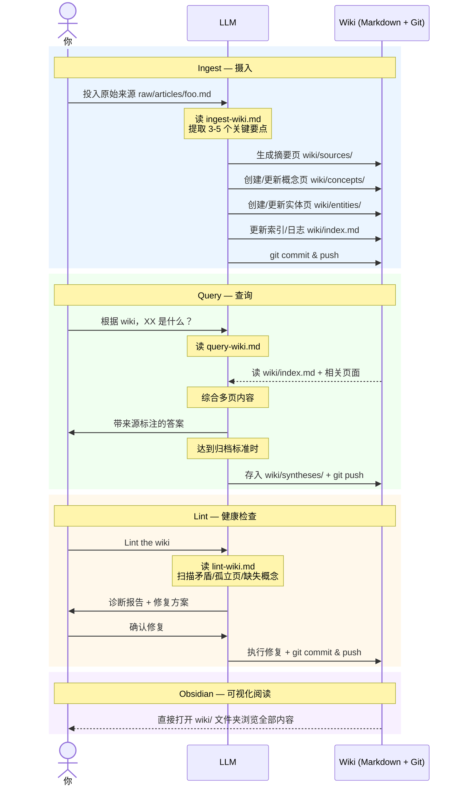

# karpathy-llm-wiki-boilerplate

> 基于 [Andrej Karpathy LLM Wiki 方案](https://gist.github.com/karpathy/442a6bf555914893e9891c11519de94f) 的个人知识库脚手架。
> Clone 下来，简单配置，即可拥有一个由 LLM 持续维护的个人 Wiki。

---

## 核心理念

传统 RAG 每次提问都从零推导，没有知识积累。这套方案不同：

**每摄入一份来源，LLM 就把知识编译进 Wiki**——更新摘要页、概念页、实体页、交叉引用。知识持续复利增长，而不是每次从零开始。

| | 传统 RAG | LLM Wiki |
|---|---|---|
| 知识处理 | 查询时实时推导 | 摄入时一次性编译 |
| 知识积累 | 无，每次重置 | 持续复利增长 |
| 维护者 | 无 | LLM（永不疲倦） |
| 可读性 | 向量，不可读 | Markdown，人可直接读 |

**分工**：人负责策展来源、提问、决策；LLM 负责摘要、归档、交叉引用、一致性维护。

---

## 工作流实现原理

本项目的工作流**完全依靠大模型 + Prompt 约束实现**，无需任何代码、数据库或外部服务——三个 Markdown 文件定义操作规范，LLM 读取后按清单执行，Git 负责持久化。



整个知识库是一份 Markdown 仓库：**人负责投料，LLM 负责编译和维护，Obsidian 负责可视化阅读**，三者分工明确、互不干扰。

---

## 目录结构

```
knowledge-vault/
├── README.md              # 本文件
├── CLAUDE.md              # Schema：工作流规范，LLM 操作前必读
├── VAULT-INDEX.md         # 实时仪表板（LLM 自动维护）
├── raw/                   # 原始来源（只读，人类写入）
│   ├── articles/          # 网页剪藏文章
│   ├── papers/
│   ├── repos/
│   ├── transcripts/
│   ├── data/
│   └── assets/
├── wiki/                  # LLM 维护的知识库（LLM 写入）
│   ├── index.md           # 主目录，查询从这里开始
│   ├── log.md             # 操作时间线（只追加）
│   ├── hot.md             # 当前会话焦点缓存
│   ├── sources/           # 每份来源的摘要页
│   ├── concepts/          # 概念解释页、
│   ├── entities/          # 人物 / 公司 / 产品页
│   ├── comparisons/
│   └── syntheses/
└── .claude/
    └── skills/            # 三种核心操作的执行手册
        ├── ingest-wiki.md
        ├── query-wiki.md
        ├── lint-wiki.md
        └── references/    # 各核心文件的空白模板备份
```

---

## 快速上手

### 1. Clone 并初始化

```bash
git clone <your-fork> ~/knowledge-vault
cd ~/knowledge-vault

# 修改远程地址为你自己的仓库
git remote set-url origin git@github.com:<你的用户名>/<你的仓库名>.git
```

### 2. 配置你的 Agent

推荐搭配 Claw 类 Agent 使用（尤其是云端 Claw），可以随时随地更新、查阅你的知识库信息，以下配置均以 OpenClaw 为例，其他 Agent 可以类推。

这是让 Agent 感知知识库的**唯一关键路径**。

Agent 每次会话启动时会读取 `SOUL.md`（或 `MEMORY.md`）建立初始上下文。如果这里没有知识库的描述，Agent 就不知道知识库的存在，也不知道该如何操作它。

将以下内容添加到你的 Agent 的 `SOUL.md` 或 `MEMORY.md`（二选一，或两者都加）：

```markdown
## 知识库工作流

**知识库位置**：`~/knowledge-vault/`

**核心规则**：
- 用户提及知识库、Ingest、Query、Lint 任何一个操作时，**必须先读 `~/knowledge-vault/CLAUDE.md`**，再执行
- "存入知识库" / "加到知识库" / "存进知识库" / "放入知识库" / "更新知识库" / "摄入" / "ingest" = 执行 **Ingest** 操作
- CLAUDE.md 是路由表，会指向具体的 skill 文件，**执行前必须读完整 skill 文件**

**三大操作**：Ingest / Query / Lint

**Git**：每次操作完成后 commit & push，详见 CLAUDE.md
```

**说明**：
- `SOUL.md` 是全局配置，每个会话都会注入，适合写入
- `MEMORY.md` 是跨会话记忆，如果你的 Agent 支持的话也可以写入
- 两者都写入效果最稳定
- 路径 `~/knowledge-vault/` 可根据你实际的 clone 路径修改

**各平台配置入口**：

| Agent | 配置文件位置 |
|-------|------------|
| **OpenClaw** | 界面中的 System Prompt 配置页 |
| **WorkBuddy** | `~/.workbuddy/SOUL.md` |
| **Claude Code** | `~/.claude/CLAUDE.md`（全局）或项目根目录 `CLAUDE.md` |
| 其他 Agent | 找到该 Agent 的全局 System Prompt 入口，粘贴上面的内容即可 |

### 3. 验证可用

对 Agent 说：**"读一下 CLAUDE.md"**，确认它能正确理解工作流。

然后执行首次摄入：

```
Ingest raw/articles/test-welcome.md
```

### 4. Obsidian（可选但推荐）

1. 打开 Obsidian → 「打开文件夹作为 Vault」→ 选择 `~/knowledge-vault`
2. Settings → Files and links → Attachment folder path → `raw/assets`
3. 推荐插件：**Obsidian Web Clipper**（浏览器扩展，一键把网页转 Markdown）

### 5. 调整知识库路径（可选）

默认路径为 `~/knowledge-vault`。如需 clone 到其他位置，需手动修改以下几处：

1. `.claude/skills/ingest-wiki.md`、`query-wiki.md`、`lint-wiki.md` 中的 `cd ~/knowledge-vault`
2. 步骤 2 中写入 SOUL.md / MEMORY.md 的路径配置

---

## 三种核心操作

### Ingest（摄入）

**方式 A**：把文章放入 `raw/articles/`，然后告诉 Agent：

```
Ingest raw/articles/你的文章.md
```

**方式 B**：直接把文件或文本内容发给 Agent，并说加入知识库：

```
把这个存入知识库
帮我记录到知识库
```

Agent 会自动判断类型归档到对应的 `raw/` 子目录，再执行后续流程。

Agent 会：归档原文 → 读文件 → 提取要点 → 建摘要页 → 更新概念/实体页 → 更新 index/log → Git push。
**一次摄入通常触碰 5-15 个 Wiki 页面。**

### Query（查询）

```
# 直接提问，或明确指向 Wiki：
根据 wiki，XX 和 YY 有什么区别？
```

Agent 会：读 index → 定位相关页 → 综合答案 → 可选归档有价值的分析。

### Lint（健检）

```
Lint the wiki
```

Agent 会：扫描矛盾、孤立页、缺失概念、过时声明 → 输出诊断报告和优先级修复方案 → 等待确认 → 执行修复 → Git push。
**建议每 20 次摄入或每月跑一次。**

---

## 随仓库附带的示例内容

这个 boilerplate 用 LLM Wiki 方法论本身作为示例数据（第一性原理：用这套方案来理解这套方案）。

**一份来源，完整跑通一次 Ingest 的效果**：

| 文件 | 类型 | 内容 |
|------|------|------|
| `raw/articles/test-welcome.md` | 原始来源 | LLM Wiki 核心概念介绍（Karpathy 原文） |
| `wiki/sources/summary-llm-wiki-intro.md` | 摘要页 | 上面那篇的 ingest 结果 |
| `wiki/concepts/llm-wiki.md` | 概念页 | LLM Wiki 方法论（含归档机制、规模演进） |
| `wiki/concepts/rag.md` | 概念页 | RAG 对比参考 |
| `wiki/concepts/zettelkasten.md` | 概念页 | Zettelkasten 方法论溯源 |
| `wiki/entities/andrej-karpathy.md` | 实体页 | 方法论提出者 |

---

## 进一步阅读

- [CLAUDE.md](CLAUDE.md) — 完整 Schema 和工作流规范
- [wiki/index.md](wiki/index.md) — Wiki 主目录
- [wiki/concepts/llm-wiki.md](wiki/concepts/llm-wiki.md) — LLM Wiki 方法论详解
- [Karpathy 原始 Gist](https://gist.github.com/karpathy/442a6bf555914893e9891c11519de94f)

---

## 致谢

方案由 [Andrej Karpathy](https://karpathy.ai/) 提出，灵感来源于 Vannevar Bush 1945 年的 Memex 构想。
