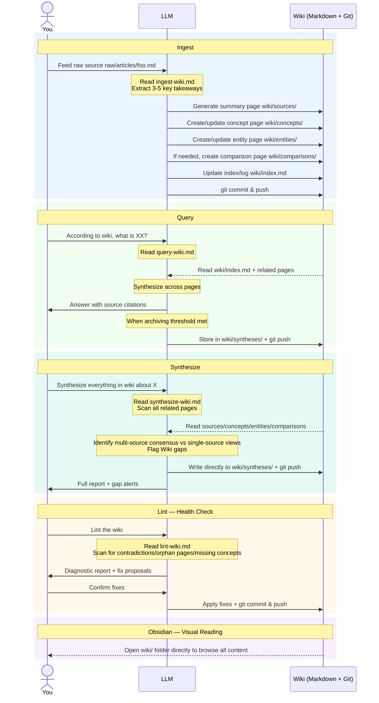

# karpathy-llm-wiki-boilerplate

> A lightweight implementation of [Andrej Karpathy's LLM Wiki approach](https://gist.github.com/karpathy/442a6bf555914893e9891c11519de94f) — no engineering dependencies, just the minimal files needed to reproduce the core workflow.
> Clone it, configure it, and you'll have a personal Wiki continuously maintained by an LLM.

📖 [中文版 README](README_zh.md)

---

## Core Philosophy

Traditional RAG derives everything from scratch on every query, with no knowledge accumulation. This approach is different:

**Every time a source is ingested, the LLM compiles knowledge into the Wiki** — updating summary pages, concept pages, entity pages, and cross-references. Knowledge compounds continuously rather than starting from zero each time.

| | Traditional RAG | LLM Wiki |
|---|---|---|
| Knowledge Processing | Real-time derivation at query time | One-time compilation at ingest time |
| Knowledge Accumulation | None, resets each time | Continuous compounding growth |
| Maintainer | None | LLM (never tires) |
| Readability | Vectors, not human-readable | Markdown, directly readable by humans |

**Division of Labor**: Humans curate sources, ask questions, and make decisions; LLMs handle summarization, archiving, cross-referencing, and consistency maintenance.

---

## How the Workflow Works

This project's workflow is **entirely driven by LLM + Prompt constraints** — no code, databases, or external services needed. Four Markdown files define the operational rules, the LLM reads them and executes accordingly, and Git handles persistence.



The entire knowledge base is a Markdown repository: **Humans feed sources, the LLM compiles and maintains, and Obsidian provides visual reading** — clear division of labor with no interference.

---

## Directory Structure

```
knowledge-vault/
├── README.md              # This file
├── CLAUDE.md              # Schema: workflow spec, LLM must read before operating
├── VAULT-INDEX.md         # Live dashboard (auto-maintained by LLM)
├── raw/                   # Raw sources (read-only, human-written)
│   ├── articles/          # Web clipped articles
│   ├── papers/
│   ├── repos/
│   ├── transcripts/
│   ├── data/
│   └── assets/
├── wiki/                  # LLM-maintained knowledge base (LLM writes)
│   ├── index.md           # Main directory, start queries here
│   ├── log.md             # Operation timeline (append-only)
│   ├── hot.md             # Current session focus cache
│   ├── sources/           # Summary page per source
│   ├── concepts/          # Concept explanation pages
│   ├── entities/          # People / Company / Product pages
│   ├── comparisons/       # Multi-dimensional comparison analysis pages
│   └── syntheses/         # Cross-source synthesis report pages
└── .claude/
    └── skills/            # Execution manuals for four core operations
        ├── ingest-wiki.md
        ├── query-wiki.md
        ├── synthesize-wiki.md
        ├── lint-wiki.md
        └── references/    # Blank template backups for core files
```

---

## Quick Start

### 1. Create Your Own Repository

Click **「Use this template」→「Create a new repository」** in the top-right corner. GitHub will create a brand new independent repository for you (not a fork, no upstream association).

Then clone it locally:

```bash
git clone git@github.com:<your-username>/<your-repo>.git ~/knowledge-vault
```

### 2. Configure Your Agent

This is the **only critical step** to make your Agent aware of the knowledge base. Without this, the Agent won't know the knowledge base exists and won't trigger any workflows.

The principle is simple: the Agent reads the global system prompt at the start of each session to establish initial context; when you say a trigger phrase, it reads the project's `CLAUDE.md`, learns the full workflow, and executes the corresponding operation.

Add the following prompt to your Agent's global system prompt:

> Replace the path `~/knowledge-vault/` with your actual clone path. If using a different path, also update the `cd ~/knowledge-vault` in the four skill files under `.claude/skills/`.

```markdown
## Knowledge Base Workflow

I have a personal knowledge base maintained by an LLM, located at `~/knowledge-vault/`.
The knowledge base accumulates knowledge through four operations: Ingest (ingest sources), Query (search & Q&A), Synthesize (synthesis reports), Lint (health checks).

**Core Rule: When any of the following trigger phrases are involved, you MUST first read `~/knowledge-vault/CLAUDE.md` in full before executing any operation.**

Trigger phrases:
- Ingest: "save to the knowledge base", "add to the knowledge base", "store in the knowledge base", "put this in the knowledge base", "save this to the wiki", "ingest", or when the user sends a file/content and mentions the knowledge base
- Query: "according to the knowledge base", "is it in the knowledge base", "what does the knowledge base say", "according to the wiki", "look up X in the knowledge base", and substantive questions about topics already in the wiki
- Synthesize: "write a synthesis on X", "help me write a report about X", "synthesize", "synthesis", "pull together everything in the wiki about X", "create a synthesis report on X"
- Lint: "check the knowledge base for issues", "any issues with the knowledge base", "clean up the knowledge base", "lint", "health check"

**Git**: Execute commit & push after each Ingest / Synthesize / Lint operation; Query only commits when archiving new content.
```

In OpenClaw/WorkBuddy, you can simply chat with the Agent to have it add the above prompt to your SOUL.md/MEMORY.md. For other Agents (like Claude Code), find the corresponding global system prompt entry and paste the prompt content manually.

**Notes**:
- `SOUL.md` is a global config injected into every session — ideal for this
- `MEMORY.md` is cross-session memory — also suitable if your Agent supports it
- Writing to both provides the most stable results

### 3. Verify It Works

Say to your Agent: **"Please search my knowledge base for what karpathy llm wiki is"** and confirm it correctly understands the workflow.

---

## Quick Start Complete 🎉

Next steps:
- Start accumulating knowledge by **Ingesting** articles you're interested in
- Read the "Advanced Usage" section below for more tips
- Refer to "Four Core Operations" for detailed command descriptions

---

## Four Core Operations

### Ingest

**Method A**: Place an article in `raw/articles/`, then tell the Agent:

```
Ingest raw/articles/your-article.md
```

**Method B**: Send a file or text content directly to the Agent and ask to add it to the knowledge base:

```
Save this to the knowledge base
Add this to the knowledge base
```

The Agent will automatically determine the type and archive it to the appropriate `raw/` subdirectory, then proceed with the ingestion flow.

The Agent will: archive the original → read the file → extract key points → create a summary page → update concept/entity pages → create a comparison page if needed → update index/log → Git push.
**A single ingestion typically touches 5-15 Wiki pages.**

> Comparison page trigger condition: When a new source has a competitive or alternative relationship with an existing concept across ≥3 comparable dimensions, a comparison analysis page is automatically created in `wiki/comparisons/`.

### Query

```
# Ask directly, or explicitly reference the Wiki:
According to wiki, what's the difference between XX and YY?
```

The Agent will: read index → locate relevant pages → synthesize an answer → when the answer draws from >2 sources and has value, ask whether to archive it to `wiki/syntheses/`.

### Synthesize

```
Synthesize everything in wiki about XX
Help me write a report about XX
```

Difference from Query: **Proactive output, written directly, no confirmation needed.**

The Agent will: scan all related pages → identify multi-source consensus vs single-source views → flag Wiki gaps → write directly to `wiki/syntheses/` → Git push.

### Lint

```
Lint the wiki
```

The Agent will: scan for contradictions, orphan pages, missing concepts, outdated claims → output a diagnostic report with prioritized fix proposals → wait for confirmation → apply fixes → Git push.
**Recommended: run once every 20 ingestions or once per month.**

---

## Advanced Usage

### Visual Reading with Obsidian

The entire `wiki/` directory is a standard Obsidian Vault — you can use the graph view to browse bidirectional link relationships.

1. Open Obsidian → "Open Folder as Vault" → select `~/knowledge-vault`
2. Settings → Files and links → Attachment folder path → `raw/assets`
3. Recommended plugin: **Obsidian Web Clipper** (browser extension that converts web pages to Markdown and saves them to `raw/articles/` with one click)

### Quick Web Ingest with Web Clipper

1. Install the Obsidian Web Clipper browser extension
2. Browse to a target web page, click the extension to clip it to `raw/articles/` with one click
3. Tell the Agent `Ingest raw/articles/{filename}.md` to complete the ingestion

### Periodic Lint for Health

The knowledge base accumulates redundancy as it grows. Recommendations:
- Run `Lint the wiki` **every 20 ingestions**
- Do a **monthly** deep clean, focusing on P0/P1 issues
- "Suggested new sources" in Lint reports are great starting points for expanding the knowledge base

### Proactively Generate Synthesis Reports

After accumulating enough sources, you can proactively ask the Agent to produce cross-source insights:

```
Synthesize everything in wiki about XX
Help me write a report comparing XX and YY
```

Synthesis reports are automatically written to `wiki/syntheses/` — this is the key operation that elevates the knowledge base from "archive" to "output."

### Scale Thresholds and Migration Path

This approach reliably scales to about **100–200 sources / 50,000–100,000 tokens**. Beyond that, `wiki/index.md` can no longer fit entirely in the context window, query quality starts to degrade, and you'll need to introduce RAG or a hybrid architecture.

For detailed analysis of scaling bottlenecks (deep comparison with RAG, three major limitations and solutions), see the original source:
- [Chapter 6: LLM Wiki vs RAG Deep Comparison](raw/articles/Karpathy_LLM_Wiki.md#六llm-wiki-vs-rag-深度对比)
- [Chapter 7: Scaling Limitations and Solutions](raw/articles/Karpathy_LLM_Wiki.md#七规模化缺陷与解决方案)

---

## Bundled Example Content

This boilerplate uses the LLM Wiki methodology itself as example data (first principles: use this approach to understand this approach).

**One source, a complete Ingest run-through**:

| File | Type | Content |
|------|------|---------|
| `raw/articles/Karpathy_LLM_Wiki.md` | Raw Source | Introduction to LLM Wiki core concepts (Karpathy's original) |
| `wiki/sources/summary-karpathy-llm-wiki.md` | Summary Page | Ingest result of the above article |
| `wiki/concepts/llm-wiki-paradigm.md` | Concept Page | LLM Wiki paradigm: compile-time knowledge accumulation, three-layer architecture, three operations |
| `wiki/concepts/rag-vs-llm-wiki.md` | Concept Page | Architectural differences between RAG and LLM Wiki, and hybrid approaches |
| `wiki/concepts/knowledge-compaction.md` | Concept Page | Knowledge compaction: the core mechanism for handling the Wiki growth paradox |
| `wiki/entities/andrej-karpathy.md` | Entity Page | Methodology creator |

---

## Further Reading

- [CLAUDE.md](CLAUDE.md) — Complete Schema and workflow specification
- [wiki/index.md](wiki/index.md) — Wiki main directory
- [wiki/concepts/llm-wiki-paradigm.md](wiki/concepts/llm-wiki-paradigm.md) — Detailed LLM Wiki methodology
- [Karpathy's Original Gist](https://gist.github.com/karpathy/442a6bf555914893e9891c11519de94f)

---

## Acknowledgments

The approach was proposed by [Andrej Karpathy](https://karpathy.ai/), inspired by Vannevar Bush's 1945 Memex concept.
