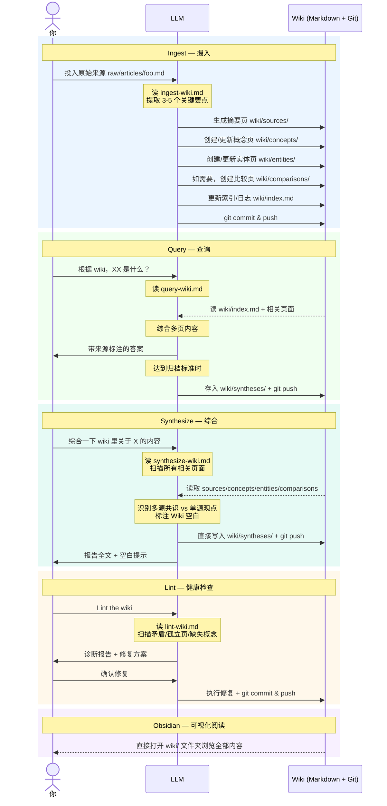

# karpathy-llm-wiki-boilerplate

>基于 [Andrej Karpathy LLM Wiki 方案](https://gist.github.com/karpathy/442a6bf555914893e9891c11519de94f) 的轻量级实现——去掉一切工程依赖，用最少的文件还原其核心工作流。
> Clone 下来，简单配置，即可拥有一个由 LLM 持续维护的个人 Wiki。

---

## 核心理念

传统 RAG 每次提问都从零推导，没有知识积累。这套方案不同：

**每摄入一份来源，LLM 就把知识编译进 Wiki**——更新摘要页、概念页、实体页、交叉引用。知识持续复利增长，而不是每次从零开始。

| | 传统 RAG | LLM Wiki |
|---|---|---|
| 知识处理 | 查询时实时推导 | 摄入时一次性编译 |
| 知识积累 | 无，每次重置 | 持续复利增长 |
| 维护者 | 无 | LLM（永不疲倦） |
| 可读性 | 向量，不可读 | Markdown，人可直接读 |

**分工**：人负责策展来源、提问、决策；LLM 负责摘要、归档、交叉引用、一致性维护。

---

## 工作流实现原理

本项目的工作流**完全依靠大模型 + Prompt 约束实现**，无需任何代码、数据库或外部服务——四个 Markdown 文件定义操作规范，LLM 读取后按清单执行，Git 负责持久化。



整个知识库是一份 Markdown 仓库：**人负责投料，LLM 负责编译和维护，Obsidian 负责可视化阅读**，三者分工明确、互不干扰。

---

## 目录结构

```
knowledge-vault/
├── README.md              # 本文件
├── CLAUDE.md              # Schema：工作流规范，LLM 操作前必读
├── VAULT-INDEX.md         # 实时仪表板（LLM 自动维护）
├── raw/                   # 原始来源（只读，人类写入）
│   ├── articles/          # 网页剪藏文章
│   ├── papers/
│   ├── repos/
│   ├── transcripts/
│   ├── data/
│   └── assets/
├── wiki/                  # LLM 维护的知识库（LLM 写入）
│   ├── index.md           # 主目录，查询从这里开始
│   ├── log.md             # 操作时间线（只追加）
│   ├── hot.md             # 当前会话焦点缓存
│   ├── sources/           # 每份来源的摘要页
│   ├── concepts/          # 概念解释页
│   ├── entities/          # 人物 / 公司 / 产品页
│   ├── comparisons/       # 多维度比较分析页
│   └── syntheses/         # 跨来源综合报告页
└── .claude/
    └── skills/            # 四种核心操作的执行手册
        ├── ingest-wiki.md
        ├── query-wiki.md
        ├── synthesize-wiki.md
        ├── lint-wiki.md
        └── references/    # 各核心文件的空白模板备份
```

---

## 快速上手

### 1. 创建你自己的仓库

点击页面右上角的 **「Use this template」→「Create a new repository」**，GitHub 会为你创建一个全新的独立仓库（非 fork，无上游关联）。

然后 clone 到本地：

```bash
git clone git@github.com:<你的用户名>/<你的仓库名>.git ~/knowledge-vault
```

### 2. 配置你的 Agent

这是让 Agent 感知知识库的**唯一关键路径**，不做这一步，Agent 不知道知识库的存在，也不会触发任何工作流。

原理很简单：Agent 每次会话启动时读取全局系统 Prompt 建立初始上下文；当你说出触发词时，它会去读项目里的 `CLAUDE.md`，从而了解完整工作流并执行对应操作。

将以下提示词写入你的 Agent 全局系统 Prompt：

> 路径 `~/knowledge-vault/` 请替换为你实际的 clone 路径。如需使用其他路径，还需同步修改 `.claude/skills/` 下四个 skill 文件中的 `cd ~/knowledge-vault`。

```markdown
## 知识库工作流

我有一个由 LLM 维护的个人知识库，位于 `~/knowledge-vault/`。
知识库通过四种操作持续积累知识：Ingest（摄入来源）、Query（检索问答）、Synthesize（综合报告）、Lint（健康检查）。

**核心规则：涉及以下任意触发词时，必须先完整读取 `~/knowledge-vault/CLAUDE.md`，再执行操作。**

触发词对照：
- Ingest（摄入）："存入知识库"、"加到知识库"、"存进知识库"、"放入知识库"、"更新知识库"、"帮我存一下"、"摄入"、"ingest"，或用户直接发来文件/内容并提到知识库
- Query（查询）："根据知识库"、"知识库里有没有"、"知识库怎么说"、"根据 wiki"、"查一下知识库"，以及涉及已收录主题的实质性提问
- Synthesize（综合）："综合一下"、"帮我写一篇关于 X 的报告"、"synthesize"、"synthesis"、"把 wiki 里关于 X 的内容整合一下"、"生成综合报告"
- Lint（健检）："检查知识库"、"知识库有没有问题"、"清理知识库"、"lint"、"健康检查"

**Git**：每次 Ingest / Synthesize / Lint 操作完成后执行 commit & push；Query 仅在归档新内容时提交。
```

在 OpenClaw/WorkBuddy 中，你可以直接通过对话跟 Agent 对话，让其帮你将上述提示词添加到 SOUL.md/MEMORY.md 中。使用其他 Agent（如 Claude Code）的话，找到对应的全局系统 Prompt 入口，把提示词内容手动粘贴进去即可。

**说明**：
- `SOUL.md` 是全局配置，每个会话都会注入，适合写入
- `MEMORY.md` 是跨会话记忆，如果你的 Agent 支持的话也可以写入
- 两者都写入效果最稳定

### 3. 验证可用

对 Agent 说：**"请从我的知识库中帮我查下 karpathy llm wiki 是什么"**，确认它能正确理解工作流。

---

## 快速上手完成 🎉

接下来可以：
- 直接 **Ingest** 你感兴趣的文章开始积累知识
- 阅读下方「进阶用法」了解更多玩法
- 参考「四种核心操作」了解每个命令的详细说明

---

## 四种核心操作

### Ingest（摄入）

**方式 A**：把文章放入 `raw/articles/`，然后告诉 Agent：

```
Ingest raw/articles/你的文章.md
```

**方式 B**：直接把文件或文本内容发给 Agent，并说加入知识库：

```
把这个存入知识库
帮我记录到知识库
```

Agent 会自动判断类型归档到对应的 `raw/` 子目录，再执行后续流程。

Agent 会：归档原文 → 读文件 → 提取要点 → 建摘要页 → 更新概念/实体页 → 如需要创建比较页 → 更新 index/log → Git push。
**一次摄入通常触碰 5-15 个 Wiki 页面。**

> 比较页触发条件：新来源与已有概念存在 ≥3 个可对比维度的竞争或替代关系时，自动在 `wiki/comparisons/` 创建比较分析页。

### Query（查询）

```
# 直接提问，或明确指向 Wiki：
根据 wiki，XX 和 YY 有什么区别？
```

Agent 会：读 index → 定位相关页 → 综合答案 → 当答案综合 >2 个来源且有价值时，询问是否归档到 `wiki/syntheses/`。

### Synthesize（综合）

```
综合一下 wiki 里关于 XX 的内容
帮我写一篇关于 XX 的报告
```

与 Query 的区别：**主动产出，直接写入，无需二次确认**。

Agent 会：扫描所有相关页 → 识别多源共识 vs 单源观点 → 标注 Wiki 空白 → 直接写入 `wiki/syntheses/` → Git push。

### Lint（健检）

```
Lint the wiki
```

Agent 会：扫描矛盾、孤立页、缺失概念、过时声明 → 输出诊断报告和优先级修复方案 → 等待确认 → 执行修复 → Git push。
**建议每 20 次摄入或每月跑一次。**

---

## 进阶用法

### Obsidian 可视化阅读

整个 `wiki/` 目录就是标准 Obsidian Vault，可以直接用图谱视图浏览双链关系。

1. 打开 Obsidian → 「打开文件夹作为 Vault」→ 选择 `~/knowledge-vault`
2. Settings → Files and links → Attachment folder path → `raw/assets`
3. 推荐插件：**Obsidian Web Clipper**（浏览器扩展，一键把网页转 Markdown 后放入 `raw/articles/`）

### 用 Web Clipper 快速摄入网页

1. 安装 Obsidian Web Clipper 浏览器扩展
2. 浏览到目标网页，点击扩展一键剪藏到 `raw/articles/`
3. 对 Agent 说 `Ingest raw/articles/{文件名}.md` 即完成摄入

### 定期 Lint 保持健康

知识库会随摄入增长而积累冗余，建议：
- **每 20 次摄入**跑一次 `Lint the wiki`
- **每月**做一次深度清理，重点关注 P0/P1 问题
- Lint 报告中的「建议新来源」是扩充知识库的好起点

### 主动生成综合报告

积累一定来源后，可以主动要求 Agent 产出跨来源洞见：

```
综合一下 wiki 里关于 XX 的内容
帮我写一篇关于 XX 和 YY 对比的报告
```

综合报告自动写入 `wiki/syntheses/`，是知识库从"存档"升级为"产出"的关键操作。

### 规模临界点与迁移路径

本方案可靠运行的上限约为 **100–200 篇来源 / 50,000–100,000 Token**。超出后 `wiki/index.md` 无法完整装入上下文窗口，查询质量开始下降，需要引入 RAG 或混合架构。

关于规模化瓶颈的详细分析（与 RAG 的深度对比、三大缺陷与解决方案），参见原始来源：
- [第六章：LLM Wiki vs RAG 深度对比](raw/articles/Karpathy_LLM_Wiki.md#六llm-wiki-vs-rag-深度对比)
- [第七章：规模化缺陷与解决方案](raw/articles/Karpathy_LLM_Wiki.md#七规模化缺陷与解决方案)

---

## 随仓库附带的示例内容

这个 boilerplate 用 LLM Wiki 方法论本身作为示例数据（第一性原理：用这套方案来理解这套方案）。

**一份来源，完整跑通一次 Ingest 的效果**：

| 文件 | 类型 | 内容 |
|------|------|------|
| `raw/articles/Karpathy_LLM_Wiki.md` | 原始来源 | LLM Wiki 核心概念介绍（Karpathy 原文） |
| `wiki/sources/summary-karpathy-llm-wiki.md` | 摘要页 | 上面那篇的 ingest 结果 |
| `wiki/concepts/llm-wiki-paradigm.md` | 概念页 | LLM Wiki 范式：编译时知识积累、三层架构、三大操作 |
| `wiki/concepts/rag-vs-llm-wiki.md` | 概念页 | RAG 与 LLM Wiki 的架构差异与混合方案 |
| `wiki/concepts/knowledge-compaction.md` | 概念页 | 知识压缩：应对 Wiki 增长悖论的核心机制 |
| `wiki/entities/andrej-karpathy.md` | 实体页 | 方法论提出者 |

---

## 进一步阅读

- [CLAUDE.md](CLAUDE.md) — 完整 Schema 和工作流规范
- [wiki/index.md](wiki/index.md) — Wiki 主目录
- [wiki/concepts/llm-wiki-paradigm.md](wiki/concepts/llm-wiki-paradigm.md) — LLM Wiki 方法论详解
- [Karpathy 原始 Gist](https://gist.github.com/karpathy/442a6bf555914893e9891c11519de94f)

---

## 致谢

方案由 [Andrej Karpathy](https://karpathy.ai/) 提出，灵感来源于 Vannevar Bush 1945 年的 Memex 构想。
